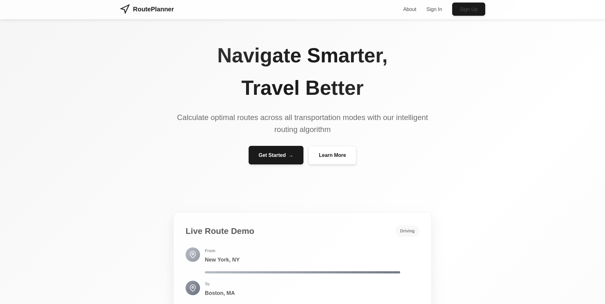
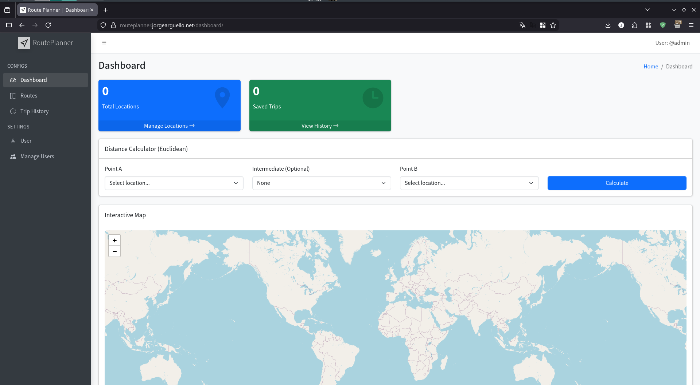
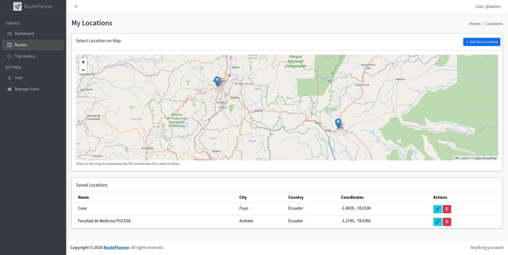
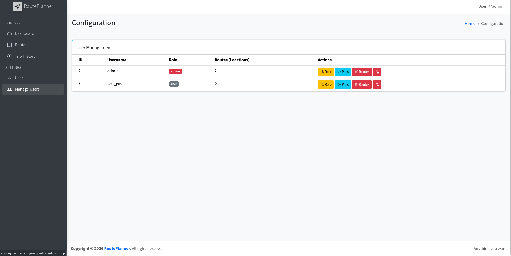
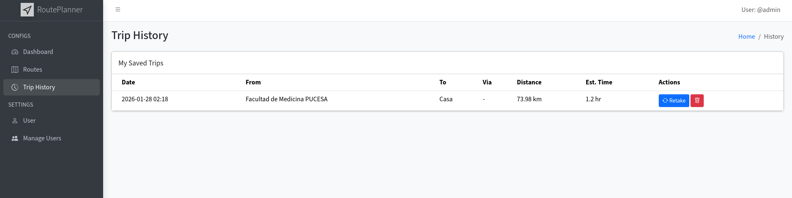
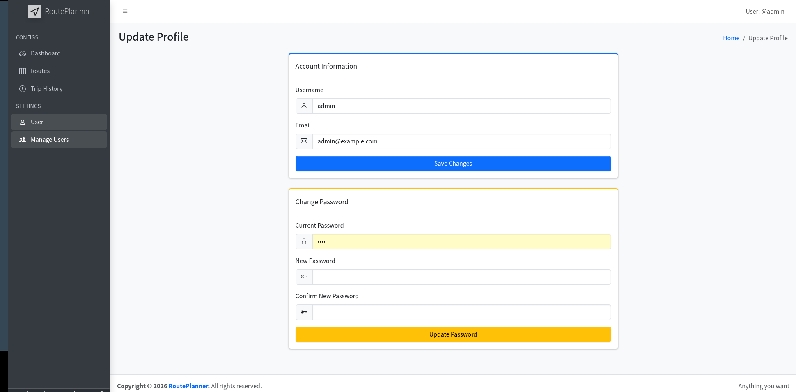

# RoutePlanner — English



**RoutePlanner** is a comprehensive web application for managing geographical locations and calculating optimal routes. It uses **Dijkstra** (via `NetworkX`) with Haversine distance, interactive maps (`Leaflet.js`), and professional PDF reports (`fpdf2` + `html2canvas`).

> **Deployment 2026:** Docker + `MySQL 8.0`, auto-migrations & seeding, `gunicorn` on **`8003`** inside and outside the container.

---

## Table of Contents
- [Features](#features)
- [Tech Stack](#tech-stack)
- [Quick Start (Docker)](#quick-start-docker)
- [Environment Variables](#environment-variables)
- [Demo / Default Admin User](#demo--default-admin-user)
- [How Deployment Works (entrypoint)](#how-deployment-works-entrypoint)
- [Verification](#verification)
- [Production Deployment](#production-deployment)
- [Troubleshooting](#troubleshooting)
- [Manual Local Run (without Docker)](#manual-local-run-without-docker)
- [Project Structure](#project-structure)

---

## Features

### 🗺️ Interactive Maps & Routing
- **Leaflet** interactive map, markers, popups.
- **Route Planning:** select Start / End / optional Mid point.
- **Dijkstra** on a dynamically built graph (nodes = your saved `Location`s, edges = Haversine km).



### 📊 Advanced Reporting
- **PDF Export** (`/graphs/export_pdf`): captured map (`html2canvas`), schematic graph (`NetworkX`+`matplotlib`), metrics (distance, ETA at 60 km/h), coordinates.


### 🔒 User & Location Management
- **Secure Auth:** `werkzeug.security` hashing, session, `UserRole` (`admin`/`moderator`/`user`).
- **CRUD Locations:** `GET/POST /locations/`, `PUT/DELETE /locations/<id>` (auth required).
- **Trip History:** `RouteHistory` persistence.
| User Management | Trip History |
| :---: | :---: |
|  |  |


---

## Tech Stack
- **Backend:** Python 3.13, Flask 3, Flask-SQLAlchemy, Flask-Migrate (Alembic)
- **DB:** MySQL 8.0 (`pymysql`) in Docker; SQLite fallback (`sqlite:///routeplanner.db`) for local dev without Docker. Postgres is still supported via `psycopg2-binary` if you change `DATABASE_URL`.
- **Frontend:** Bootstrap 5 / AdminLTE, Leaflet.js, Jinja2
- **Graph:** NetworkX, matplotlib
- **PDF:** fpdf2, html2canvas (client capture)
- **Server:** gunicorn 26 (prod) / Flask dev server (local)
- **Tooling:** `uv`, Docker, docker-compose

---

## Quick Start (Docker)

### Prerequisites
- Docker >= 20.10 & Docker Compose v2 (`docker compose version`)
- Git
- (Optional) `uv` for local dev without Docker

### 1. Clone
```bash
git clone <your-repo-url> RoutePlanner
cd RoutePlanner
```

### 2. Configure env
```bash
cp .env.example .env
# edit .env if you want to change secrets (recommended for prod)
# At minimum set SECRET_KEY, ENCRYPTION_KEY, ADMIN_PASSWORD
```

### 3. Run (development)
```bash
docker compose up --build
# or detached:
docker compose up --build -d
docker compose logs -f web
docker compose logs -f db
```
- **App:** http://localhost:8003
- **MySQL:** localhost:3306 (`route_user` / `route_password` → DB `routeplanner`)

### 4. Stop / Reset
```bash
docker compose down        # keep data (mysql_data volume)
docker compose down -v     # also delete DB data (fresh start)
```

---

## Environment Variables

| Variable | Default (Dockerfile / compose) | Description |
|---|---|---|
| `HOST` | `0.0.0.0` | Flask/gunicorn bind |
| `PORT` | `8003` | **Exposed** `8003:8003` (change both sides if you need another port) |
| `DATABASE_URL` | `mysql+pymysql://route_user:route_password@db:3306/routeplanner` | SQLAlchemy URI. Fallback `sqlite:///routeplanner.db` if empty (fixes `RuntimeError: Either 'SQLALCHEMY_DATABASE_URI'...`) |
| `SECRET_KEY` | `dev-secret-key-change-in-production` | Flask session. **Change in prod** |
| `ENCRYPTION_KEY` | `0A1glB0r_8tPpo8k9eeWZW3TXvkvCPpw1ZgBmsV5D6s=` | Fernet 44-char. Must be valid Fernet (previous `dev_encryption_key` was invalid) |
| `CONFIG_ACCESS_KEY` | `admin` | Key for `/configuration` when not admin |
| `ADMIN_USERNAME` | `admin` | Demo admin login |
| `ADMIN_EMAIL` | `admin@routeplanner.local` | Demo admin email |
| `ADMIN_PASSWORD` | `Admin123!` | **Change after first login** or via env |
| `ADMIN_FORCE_RESET` | `false` | If `true`, resets admin password on every container start |
| `MYSQL_ROOT_PASSWORD` | `rootpassword` | MySQL root |
| `MYSQL_DATABASE` | `routeplanner` |  |
| `MYSQL_USER` | `route_user` | Must match `DATABASE_URL` user |
| `MYSQL_PASSWORD` | `route_password` | Must match `DATABASE_URL` password |

> `config.py` now provides safe defaults so `uv run app.py` without `.env` no longer crashes.

---

## Demo / Default Admin User

The container **auto-creates** an admin on every start (`entrypoint.sh` + `seed.py`, idempotent):

- **URL:** http://localhost:8003
- **Go to:** `Sign In` → username `admin` / password `Admin123!`
- **Capabilities (UserRole.ADMIN):** manage all users, change any role (`admin`/`moderator`/`user`), delete any `Location` batch, reset passwords, access `/configuration` without extra key, view all histories.
- **To change credentials:**
  ```bash
  # option A: via env before start
  ADMIN_USERNAME=myadmin ADMIN_EMAIL=me@example.com ADMIN_PASSWORD='S3cure!' docker compose up --build
  # option B: via UI after login -> /users/update & /users/change-password
  # option C: via /configuration (admin panel) -> Update Password
  # option D: force reset on next boot
  ADMIN_FORCE_RESET=true docker compose up -d
  ```
- **Create normal users:** `Sign Up` page (`/users/signup`) → role `user` by default. An admin can promote them in `/configuration`.

**How to know if demo is running? (deploy notifies you)**
- **During deploy:** `entrypoint.sh` now prints a banner and verification *before* starting gunicorn:
  ```
  >> Verifying demo user (AVISO deploy - ¿demo corriendo?)...
    ✅ DEMO USER READY: 'admin' / 'Admin123!' -> http://localhost:8003/users/signin
  ========================================
    RoutePlanner DEPLOY COMPLETE
    App:      http://localhost:8003
    Health:   http://localhost:8003/health
    Demo chk: curl http://localhost:8003/health/demo
    Login:    http://localhost:8003/users/signin
    Demo:     admin / Admin123!
  ========================================
  ```
  If it shows `❌ MISMATCH` or `❌ NOT FOUND`, follow the hint (e.g., `ADMIN_FORCE_RESET=true docker compose up -d`).

- **After deploy (runtime):**
  ```bash
  docker compose logs web | grep -A5 "DEMO USER"  # deploy aviso
  curl -s http://localhost:8003/health/demo | python3 -m json.tool
  # {"demo_ready": true/false, "db": "ok", "hint": "Login en /users/signin..."}
  curl -s http://localhost:8003/health | python3 -m json.tool  # also includes demo_ready
  docker compose exec web python seed.py  # manual re-seed if demo missing
  ```

**If you run without Docker** (SQLite fallback) you still get the admin:
```bash
uv sync
# ensure DATABASE_URL is empty (or unset) to use SQLite: leave .env DATABASE_URL blank
uv run python seed.py          # should print [seed] Created / already exists
DATABASE_URL= uv run python -c "from app import app; from models.users import User; with app.app_context(): u=User.query.filter_by(username='admin').first(); print(u.check_password('Admin123!'))" # -> True
uv run python app.py           # http://localhost:8003
# check demo: curl http://localhost:8003/health/demo | jq .demo_ready
```

---

## How Deployment Works (entrypoint)

`entrypoint.sh` (set as `ENTRYPOINT` in `Dockerfile`) fixes previous bugs:

1. **Wait for DB:** parses `DATABASE_URL`, `pymysql` loop 60×2s (or `psycopg2` for Postgres, or skip for SQLite).
2. **Migrations:** `flask db upgrade` (Alembic). If missing migrations (e.g., `locations`/`route_history` tables not yet in `migrations/versions/`), it warns but continues.
3. **Ensure tables:** `python -c "db.create_all()"` after importing all models — guarantees tables exist even if migrations incomplete (previous bug).
4. **Stamp:** `flask db stamp head` to align `alembic_version` with `create_all`.
5. **Seed:** idempotent admin creation (checks `username` then `email`, promotes if needed).
6. **Start:** `gunicorn --bind 0.0.0.0:8003 --workers 2 --threads 4 app:app` (falls back to `uv run python app.py` if gunicorn missing).

`Dockerfile` now:
- `EXPOSE 8003`, `ENV PORT=8003 HOST=0.0.0.0`, `HEALTHCHECK curl -f http://localhost:${PORT}/`
- `uv sync --frozen --no-cache --system` + `chmod +x entrypoint.sh`

`docker-compose.yml` (dev) and `docker-compose.prod.yml` (prod):
- `image: mysql:8.0` with `healthcheck: mysqladmin ping`, `volumes: mysql_data:/var/lib/mysql`, `ports: 3306:3306`
- `web: 8003:8003`, `depends_on: db: condition: service_healthy`

---

## Verification (deploy notifies you)

```bash
docker compose ps
docker compose logs web  # should end with "DEMO USER READY" + "DEPLOY COMPLETE" + "Using gunicorn"
curl -f http://localhost:8003/health && echo "APP OK"
curl -s http://localhost:8003/health/demo | python3 -m json.tool  # check demo_ready + hint
docker compose logs web | grep -E "DEMO USER|DEPLOY COMPLETE|HEALTH"
# login test
curl -c cookies.txt -b cookies.txt -L http://localhost:8003/users/signin -d "username=admin&password=Admin123!"
```

Expected `entrypoint.sh` log (now with demo aviso):
```
=== RoutePlanner Entrypoint ===
>> Waiting for MySQL to be ready...
  MySQL at db:3306/routeplanner is ready!
>> Running migrations...
>> Ensuring all tables exist...
>> Seeding default admin user...
  Successfully created admin user: admin / admin@routeplanner.local
>> Verifying demo user (AVISO deploy - ¿demo corriendo?)...
  ✅ DEMO USER READY: 'admin' / 'Admin123!' -> http://localhost:8003/users/signin
========================================
  RoutePlanner DEPLOY COMPLETE
  App:      http://localhost:8003
  Health:   http://localhost:8003/health
  Demo:     admin / Admin123!
========================================
>> Starting application on 0.0.0.0:8003
  Using gunicorn
```
If you see `❌ DEMO USER PASSWORD MISMATCH` → `ADMIN_FORCE_RESET=true docker compose up -d` then `curl /health/demo`.

---

## Production Deployment

```bash
cp .env.example .env
# edit .env: SECRET_KEY, ENCRYPTION_KEY (generate: python -c "from cryptography.fernet import Fernet; print(Fernet.generate_key().decode())"), ADMIN_PASSWORD, MYSQL_PASSWORD, etc.
docker compose -f docker-compose.prod.yml up --build -d
docker compose -f docker-compose.prod.yml logs -f web
```

Notes:
- `docker-compose.prod.yml` has `restart: always` and separate volume `route-planner-prod_mysql_data`.
- To use a prebuilt image: uncomment `image: jorgearguello/route-planner:1.0` and comment `build: .`.
- Behind a reverse proxy (nginx/traefik) forward to `8003`, enable TLS.
- Change `ADMIN_PASSWORD` immediately after first login.

---

## Troubleshooting

| Symptom | Cause / Fix |
|---|---|
| `RuntimeError: Either 'SQLALCHEMY_DATABASE_URI'...` | Old code without fallback. Fixed in `config.py`. Ensure `DATABASE_URL` is set or use default SQLite. `docker compose` already sets it. |
| `ValueError: ENCRYPTION_KEY must be set` / Fernet invalid | Old `dev_encryption_key` not a valid 44-char Fernet. Now default `0A1glB0r_8tPpo8k9eeWZW3TXvkvCPpw1ZgBmsV5D6s=` works, or set a real `Fernet.generate_key()`. |
| `table users already exists` on `flask db upgrade` | DB was created via `create_all` without Alembic stamp. Fixed: entrypoint does `db.create_all()` + `flask db stamp head`. Safe to ignore. |
| MySQL not ready / `pymysql` connection refused | `entrypoint.sh` waits 120s. Check `docker compose logs db`, ensure `MYSQL_USER`/`MYSQL_PASSWORD` match `DATABASE_URL`. `docker compose down -v` for fresh DB if credentials changed. |
| `admin` login fails / `demo_ready:false` | `curl http://localhost:8003/health/demo` shows `hint`. `docker compose logs web \| grep DEMO` shows `MISMATCH/NOT FOUND`. Try `ADMIN_FORCE_RESET=true docker compose up -d` or `docker compose exec web python seed.py` or `DATABASE_URL= uv run python seed.py` for local SQLite. Also check `DATABASE_URL` in `.env` — for local without Docker leave `DATABASE_URL=` blank. |
| Port already in use `8003` | Change `ports: "8003:8003"` and `PORT` env together, or `lsof -i :8003` / `docker ps`. |

---

## Manual Local Run (without Docker)

```bash
# requires Python 3.13 + uv
uv sync
cp .env.example .env  # or leave empty -> SQLite fallback
uv run python seed.py
uv run python app.py          # http://localhost:8003 (or gunicorn)
# or
uv run gunicorn --bind 127.0.0.1:8003 app:app
```

`config.py` fallback → no need to set `DATABASE_URL` locally; `instance/routeplanner.db` is created and ignored by `.dockerignore`/`.gitignore`.

---

## Project Structure
```
RoutePlanner/
├── app.py                 # Flask app, init_db, register_routes, run
├── config.py              # Config with safe defaults (SECRET, ENCRYPTION, DB URI)
├── entrypoint.sh          # wait DB, migrate, create_all, seed admin, gunicorn
├── seed.py                # standalone seed script
├── Dockerfile             # python:3.13-slim, uv, 8003, HEALTHCHECK, ENTRYPOINT
├── docker-compose.yml     # dev: MySQL 8.0, 8003:8003, volume mysql_data
├── docker-compose.prod.yml# prod: restart always, prod env
├── .env.example           # template
├── pyproject.toml / uv.lock
├── models/                # User, Location, API_Storage, RouteHistory, db/migrate
├── controllers/           # business logic (users, locations, graphs, etc.)
├── routers/               # Blueprint endpoints
├── utils/                 # auth, encryption
├── templates/ / static/   # Jinja2 + AdminLTE + Leaflet
├── migrations/            # Alembic versions
└── test/                  # verify_* scripts
```

See `DEVELOPMENT.md` for developer deep-dive (architecture, migrations, auth, graph algorithm, contributing).

---

**Maintained by Jorge Arguello — RoutePlanner 2026**
