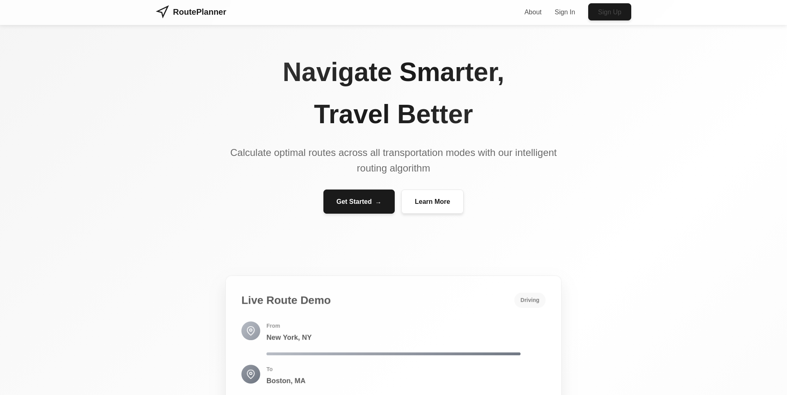
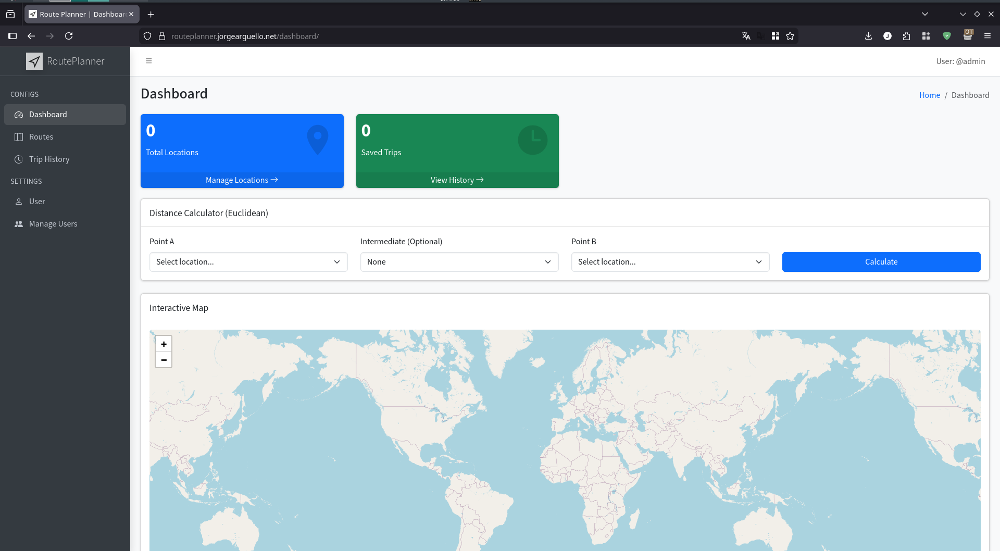
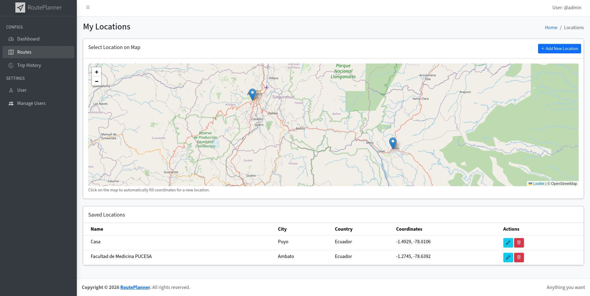
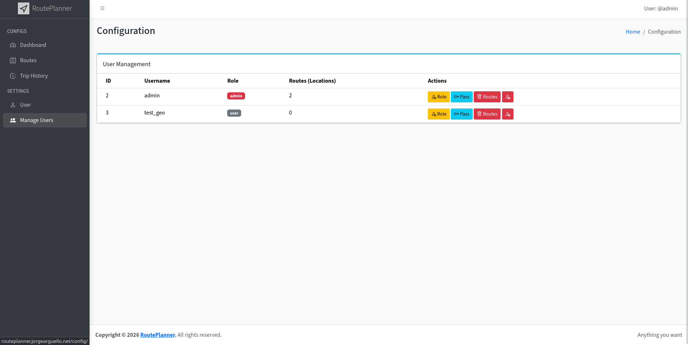
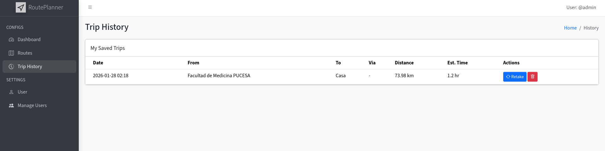
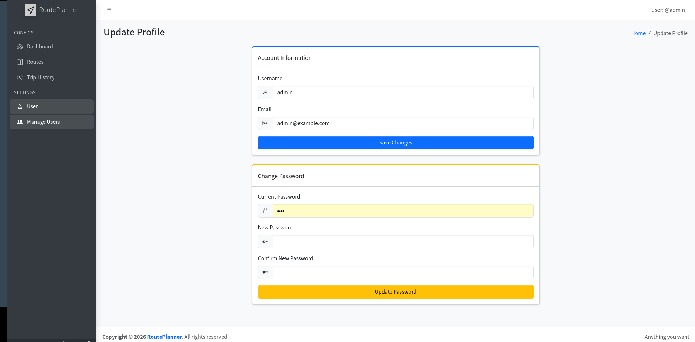

# RoutePlanner



**RoutePlanner** is a comprehensive web application designed for managing geographical locations and calculating optimal routes. It leverages advanced graph algorithms like **Dijkstra** to find the shortest paths and provides professional reporting features with PDF export capabilities.

## 🚀 Features

### 🗺️ Interactive Maps & Routing

- **Leaflet Integration**: Visualize your world with interactive maps.
- **Route Planning**: Select Start, End, and Intermediate points to calculate the best route.
- **Dijkstra's Algorithm**: backend logic ensures the shortest path using Haversine distance.



### 📊 Advanced Reporting

- **PDF Export**: Generate detailed route reports including:
  - **Visual Map Capture**: Client-side capture of the map layout.
  - **Metrics**: Total distance and estimated travel time.
  - **Coordinates**: Precise locations for all waypoints.



### 🔒 User & Location Management

- **Secure Authentication**: Robust login and role management.
- **Location Database**: Save, edit, and manage your favorite locations.
- **Trip History**: Keep track of all your planned journeys.

| User Management | Trip History |
| :---: | :---: |
|  |  |

## 🛠️ Technology Stack

- **Backend**: Python, Flask, SQLAlchemy.
- **Database**: PostgreSQL (Dockerized) / MySQL Compatible.
- **Frontend**: Bootstrap 5 (AdminLTE), Leaflet.js, Jinja2.
- **Graph Engine**: NetworkX, Matplotlib.
- **Reporting**: FPDF2, html2canvas.



## 🐳 Getting Started (Docker)

The easiest way to run the application is via Docker Compose.

1. **Clone and Build**:

   ```bash
   docker-compose up --build
   ```

2. **Access the App**:
   - Web: [http://localhost:5000](http://localhost:5000)
   - Database: Port `5432`

3. **Default Credentials**:
   - *Check the `.env` file or `docker-compose.yml` for initial setup.*

## 📦 Manual Installation

1. **Install Dependencies**:

   ```bash
   uv pip install -r requirements.txt
   ```

2. **Configure Environment**:
   - Rename `.env.example` to `.env` and set your `DATABASE_URL`.
3. **Run**:

   ```bash
   flask run
   ```
